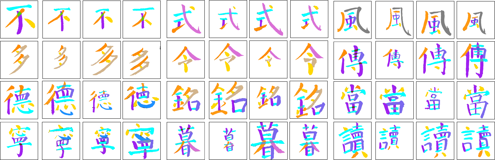

# Brush Calligraphy Stroke Segmentation Dataset (BCSS)

## Introduction

The Brush Calligraphy Stroke Segmentation Dataset (BCSS) is a comprehensive dataset designed for the task of brush calligraphy stroke segmentation. It is constructed based on the Evaluated Chinese Calligraphy Copies (E3C) dataset [^1], an aesthetic evaluation dataset of Chinese brush calligraphy, and includes additional images from various sources to enhance diversity and support the evaluation of model generalization.

## Dataset Structure

BCSS consists of 1,322 images with 10,653 annotated strokes, divided into the following subsets:

- Training and Validation Set: 1,022 images from the E3C dataset.
- External Testing Set: 300 images, including:
  - 90 images from E3C dataset, containing character types unseen in the training and validation sets.
  - 113 handwritten images extracted from the CCSE-W dataset[^2].
  - 97 images covering different styles of Chinese characters, including regular printed and brush calligraphy such as Clerical Script.

## Applications

BCSS can be used to train and evaluate models for brush calligraphy stroke segmentation tasks. It provides a diverse range of Chinese character styles and a comprehensive testing set to assess the generalization capability of the models.

## Access

The BCSS dataset is publicly available for research purposes. We will publish the dataset in the near future!

## Contact

For any questions or inquiries about the dataset, please contact zeyangbai.rvo@gmail.com or [xiebin@csu.edu.cn](mailto:xiebin@csu.edu.cn) .

## References

[^1]: Sun, M., et al.: SRAFE: Siamese Regression Aesthetic Fusion Evaluation for Chinese Calligraphic Copy. *CAAI Trans. Intell. Technol*. 8(3), 1077–1086 (2023). https://doi.org/10.1049/cit2.12095
[^2]: Liu, L., Lin, K., Huang, S., Li, Z., Li, C., Cao, Y., & Zhou, Q. (2022). Instance Segmentation for Chinese Character Stroke Extraction, Datasets and Benchmarks. *ArXiv*. /abs/2210.13826

