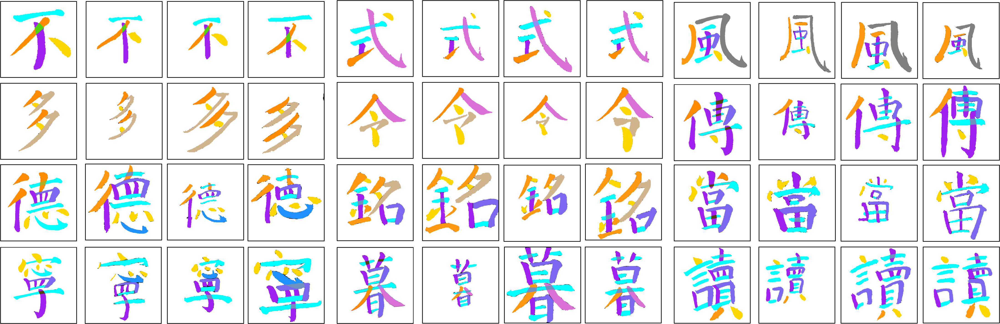

# Brush Calligraphy Stroke Segmentation Dataset (BCSS)

## Introduction

The Brush Calligraphy Stroke Segmentation Dataset (BCSS) is a comprehensive resource for the task of brush calligraphy stroke segmentation. It is derived from the Evaluated Chinese Calligraphy Copies (E3C) dataset [^1], an aesthetic evaluation dataset for Chinese brush calligraphy, and augmented with additional images from diverse sources. This expansion enhances the dataset's diversity and supports the evaluation of model generalization.

## Dataset Structure



The BCSS dataset consists of 1,322 images and 10,653 annotated strokes, distributed across the following subsets:

- **Training and Validation Set**: 1,022 images from the E3C dataset.
- **External Testing Set**: 300 images, including:
  - 90 images from the E3C dataset, containing character types not seen in the training and validation sets.
  - 113 handwritten images extracted from the CCSE-W dataset [^2].
  - 97 images representing various Chinese character styles, including regular printed and brush calligraphy forms, such as Clerical Script.

## Applications

BCSS can be used to train and evaluate models for brush calligraphy stroke segmentation. It offers a rich variety of Chinese character styles and a comprehensive testing set, which enables the evaluation of model generalization capabilities across different writing styles.

The `modeling` directory contains sample code for the task, implemented using a Fully Convolutional Network (FCN) [^3]. The model proposed in our paper is built on the DeepLab v3 framework [^4], and further modifications can be made based on the Stroke-Seg paper details.

## Dataset Access

The BCSS dataset is publicly available for research purposes. Some raw data can be found in the `instances` directory, while the annotation source files for template characters are located in the `labels` directory. These annotations are provided for reference and formatting purposes.

## Contact

For inquiries or additional information about the dataset, please contact:

- [zeyangbai.rvo@gmail.com](mailto:zeyangbai.rvo@gmail.com)
- [xiebin@csu.edu.cn](mailto:xiebin@csu.edu.cn)

## References
[^1]: Sun, M., et al. (2023). SRAFE: Siamese Regression Aesthetic Fusion Evaluation for Chinese Calligraphic Copy. *CAAI Transactions on Intelligent Technology*, 8(3), 1077–1086.
[^2]: Liu, L., Lin, K., Huang, S., Li, Z., Li, C., Cao, Y., & Zhou, Q. (2022). Instance Segmentation for Chinese Character Stroke Extraction: Datasets and Benchmarks. *arXiv*, 2210.13826.
[^3]: Long, J., Shelhamer, E., & Darrell, T. (2015). Fully Convolutional Networks for Semantic Segmentation. In *Proceedings of the IEEE Conference on Computer Vision and Pattern Recognition* (pp. 3431-3440). 
[^4]: Chen, L. C., Papandreou, G., Schroff, F., & Adam, H. (2017). Rethinking Atrous Convolution for Semantic Image Segmentation. *arXiv preprint arXiv:1706.05587*. 


## Citation

If you use our dataset, code, or methods, please cite the following paper:

```tex
@article{gong2024stroke,
  title={Stroke-Seg: A Deep Learning-Based Framework for Chinese Stroke Segmentation},
  author={Gong, Xinyu and Bai, Zeyang and Nie, Haitao and Xie, Bin},
  journal={IET Image Processing},
  volume={18},
  number={13},
  pages={4341--4355},
  year={2024},
  publisher={Wiley Online Library}
}
```
